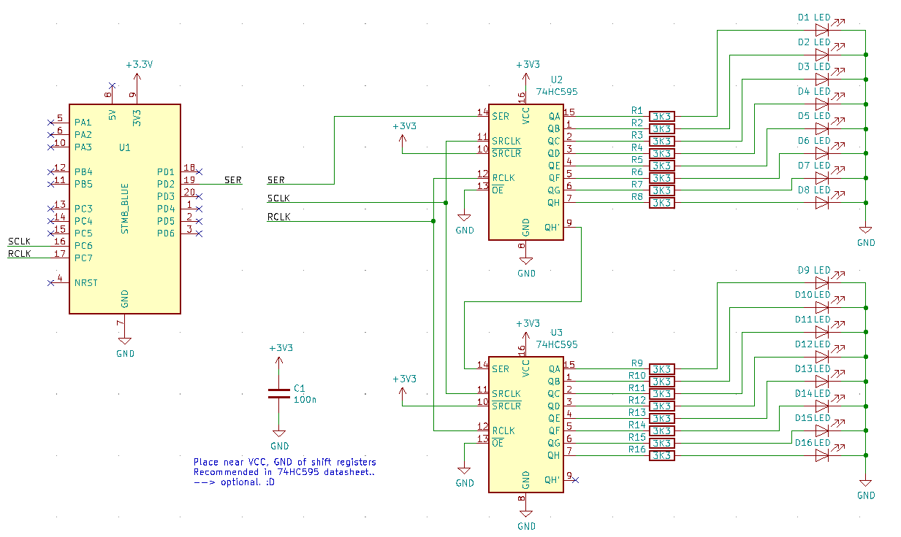

# 16 LED shift register twinkler
Designed to be built into christmas ornament, ugly christmas sweater etc.

Uses timer based "PWM" to control LED brighness through shift registers. For this reason the PWM frequency as well as the amount of brightness steps as well as the frequency these steps are applied is pretty limited. Adjust values in defines to liking...

Works pretty well anyway.

- [STM8 1 dollar board](https://tenbaht.github.io/sduino/hardware/stm8blue/)
- 2 x HC595 shift registers
- 16 x LEDs
- 16 x resistors, I used 3k3 so the LEDs weren't irritatinly blind.
- some small cap

