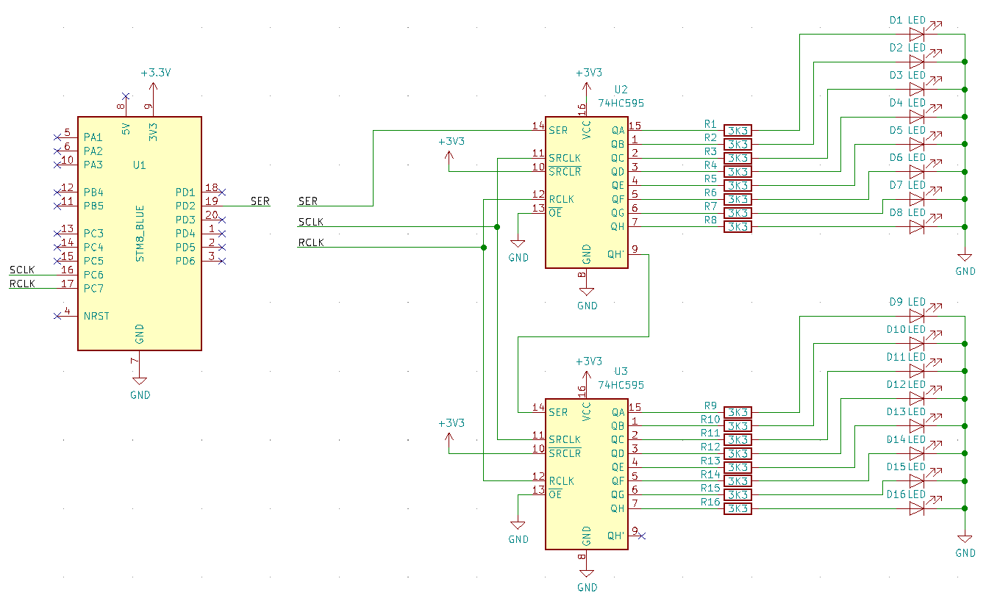

# 16 LED shift register twinkler
Designed to be built into christmas ornament, ugly christmas sweater etc.
  

- [STM8 1 dollar board](https://tenbaht.github.io/sduino/hardware/stm8blue/)
- 2 x HC595 shift registers
- 16 x LEDs
- 16 x resistors, I used 3k3 so the LEDs weren't irritatinly blind.
